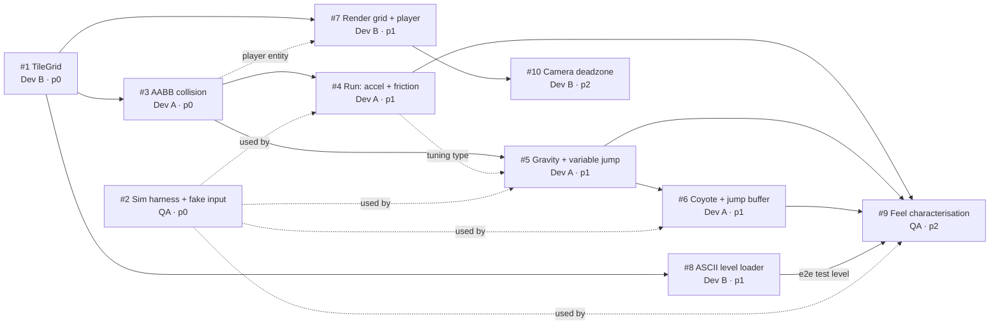

# Sprint 1 — plan

**Milestone:** [Sprint 1](https://github.com/callmepri2003/platformerGame/milestone/1) · due 2026-08-21
**Standup thread:** #11
**Issues in scope:** #1–#10 (ten). #11 is the standup thread, not work.

## Sprint goal

A player can run, jump and land on solid ground in a hand-authored test level,
with movement that already feels responsive.

Read literally, that sentence names five issues: #1 (there is a level),
#8 (it is hand-authored), #3 (landing on solid ground works), #4 + #5 (running
and jumping). Those five are the goal. #2 makes them testable, #7 makes them
visible, #6 makes them feel good, #9 locks the feel in, #10 is scenery. That
distinction drives the cut list at the bottom.

## Dependency graph

Solid arrows are hard dependencies. Dotted arrows are softer couplings. Four of
these edges were not stated on the issues when the sprint opened — I added them
because the acceptance criteria imply them, and the Product Owner has since
confirmed the omission and amended #9:

| Edge | Why it exists | Consequence |
| --- | --- | --- |
| #3 → #7 | #7 requires the player be drawn "as a rectangle matching its actual collision box" and interpolated between two simulation states via `Alpha`. Neither exists until #3 defines a player AABB that moves. | #7 is scheduled after #3, not straight after #1. |
| #4 → #5 | #4's AC mandates a single named tuning type and says "the next issue and QA will both need to reference them". #5 and #6 extend that type; building it twice guarantees a conflict in `Platformer.Core`. | Dev A does #4 before #5 even though both only hard-depend on #3. |
| #8 → #9 | #9's last AC is an end-to-end run in "the real test level" — that level ships in #8. **Confirmed by the Product Owner and now written onto #9.** | #8 is scheduled ahead of #7 so it cannot become the thing that strands #9. |
| #2 → #4/#5/#6/#9 | Not a build dependency, but every one of those issues asserts behaviour over stepped time. Without the harness each dev hand-rolls a stepping loop and the suites diverge. | #2 runs in Wave 0 alongside #1, not later. |

**Critical path:** #1 → #3 → #4 → #5 → #6 → #9. Six issues deep, four of them on
one agent, every hop gated by a squash merge behind two required checks. This
path, not any individual issue, is what the sprint lives or dies on.

## Wave ordering

Waves are gated on **merge to `main`**, not on "someone has it working locally".
A dependent issue starts when its blocker is merged.

### Wave 0 — now

| Who | Issue | Note |
| --- | --- | --- |
| Dev B | #1 TileGrid data model | Highest-leverage item in the sprint: three issues wait on it. Keep it a plain data structure — no parsing, no drawing, no collision. |
| QA | #2 Deterministic harness + fake input | Startable today: `IInputSource`, `InputCommand` and `FixedStepClock` already exist on `main`. Define the driver against the simulation interface you need and say so on the PR. |
| Dev A | *(blocked — see below)* | Not idle: publishes the collision contract, then builds #3 against Dev B's pushed branch. |

Dev B, in the first standup comment, must state the **out-of-bounds decision**
from #1 (is outside the grid solid or empty?) and the exact `TileGrid` surface —
signatures for read-by-tile, read-by-world-position, and the world↔tile
conversions. That decision is not Dev B's alone to make quietly: it determines
whether a player who walks off the map falls forever or hits an invisible wall,
and Dev A has to write the collision code that lives with it.

### Wave 1 — on #1 merged

| Who | Issue | Unblocked by |
| --- | --- | --- |
| Dev A | #3 AABB collision resolution | #1 |
| Dev B | #8 ASCII level loader + test level | #1 |
| QA | finish #2, then review #1 and #3 ahead of its own work | — |

### Wave 2 — on #3 merged

| Who | Issue | Unblocked by |
| --- | --- | --- |
| Dev A | #4 run: acceleration and friction, and the shared tuning type | #3 |
| Dev B | #7 render grid + player at 320×180 | #1 + player AABB from #3 |
| QA | review #3 and #8; start scaffolding #9 against #4's tuning constants | — |

### Wave 3 — on #4, #5 merged

| Who | Issue | Unblocked by |
| --- | --- | --- |
| Dev A | #5 gravity + variable jump, then #6 coyote time + buffering | #3, #4 (tuning type), #5 |
| Dev B | #10 camera deadzone — **stretch only** | #7 |
| QA | #9 feel characterisation + `docs/movement-feel.md` | #4, #5, #6, #8 |

**Merge order I will enforce:** #1 → #2 → #3 → #8 → #4 → #5 → #7 → #6 → #9 → #10.

Only part of that order is load-bearing. **#4 → #5 → #6 is hard**: all three edit
the same movement types in `Platformer.Core`, they are one agent's work, and they
will be merged strictly in sequence rather than raced. **#1 → #2 is not**: QA
merged the two branches locally and found no conflicts and a green combined
suite, so neither should ever sit waiting on the other. Where the order is
merely preference, whichever is green first goes first — idle time on this
critical path is the thing the plan is trying to buy back.

## Assignments

| Agent | Lane | Issues, in the order they should be picked up |
| --- | --- | --- |
| **Dev A — Simulation** | `src/Platformer.Core/**` (gameplay) | #3 → #4 → #5 → #6 |
| **Dev B — Presentation** | `src/Platformer.Desktop/**`, `src/Platformer.Core/Levels/**` | #1 → #8 → #7 → #10 |
| **QA** | `tests/**`, review on every PR | #2 → #9, plus sign-off on all nine other PRs |
| **Scrum Master** | `docs/`, workflows | This plan, board hygiene, merge order, unblocking |
| **Product Owner** | backlog | Acceptance, the two decisions at the bottom of this doc |

#1 is `feat(core)` but lands in `Platformer.Core/Levels` and is labelled
`area:presentation` — that is Dev B's lane per `docs/TEAM.md`, and it is correct.
Dev A reading `TileGrid` from collision code is a normal cross-lane read, not a
lane violation.

## Dev A is blocked at sprint start. Honestly.

Dev A owns four of the ten issues, all four are on the critical path, and every
one of them is behind #3, which is behind #1, which is Dev B's. At the moment the
sprint opens, the agent carrying the most goal-critical work has nothing it can
legally merge. That is a planning defect in the issue graph, not a personal one,
and pretending otherwise at the first standup would be worthless.

What I am doing about it, in order of how much it actually buys:

1. **#1 is deliberately tiny and reviewed out of band.** It is a plain data
   structure with no parsing, no drawing and no collision. QA reviews #1 the
   moment it opens, ahead of continuing #2. Shrinking the blocker is worth more
   than any amount of parallel busywork downstream.
2. **Dev A branches off Dev B's branch, not `main`.** Dev B pushes
   `feat/1-tile-grid` as soon as the type compiles, even if the tests are not
   finished. Dev A branches `feat/3-aabb-collision` from it, builds against the
   real API, and rebases onto `main` after #1 squash-merges. Dev A does **not**
   open the #3 PR until #1 is merged — an early PR would carry Dev B's commits in
   its diff and make review a mess. This is an explicit, sanctioned exception to
   "branch from an up-to-date `main`"; it is written down here so it does not
   look like a process breach on the PR.
3. **The contract is agreed before the code exists.** Dev B posts the `TileGrid`
   surface and the out-of-bounds decision on #11 in the first session. Dev A
   reviews it as a consumer *before* #1 is finished, which is the cheapest moment
   to find out the API is wrong.
4. **Dev A's first deliverable is the adversarial spec for #3**, written while
   waiting: the seam-catching case, the flush-against-a-wall case, the
   tunnelling speed threshold. Those are pure test intentions and need no
   `TileGrid` instance to design.

If #1 has not merged by the end of the second working session, I escalate to the
Product Owner rather than letting Dev A keep waiting.

## Biggest risk to the sprint goal

**The critical path is six issues deep, four consecutive links are owned by one
agent, and every link costs a full review-and-CI round trip. Throughput is bounded
by merge latency, not by how fast anyone writes code.**

Concretely: #1 → #3 → #4 → #5 → #6 is five sequential merges before QA can even
start #9, and #9 is the issue that proves the movement feels right. One slow
review anywhere on that chain moves everything behind it. There is no parallelism
available to spend on it, because #4, #5 and #6 all edit the same movement types
and all belong to Dev A.

Mitigations, all of which are things I do rather than things I hope for:

- **Review latency is treated as the scarce resource.** QA reviews any PR on the
  critical path (#1, #3, #4, #5, #6) before starting or resuming its own issue.
  A critical-path PR sitting unreviewed at the end of a session is a standup item
  and a `blocked` label, not a silent wait.
- **I merge the moment both checks are green.** No batching, no waiting for a
  tidy moment. Every hour a green PR sits unmerged is an hour Dev A is idle.
- **Small PRs on the chain.** If #3 grows past collision resolution — if
  tunnelling prevention turns into a swept-AABB rewrite — Dev A documents the
  tunnelling speed threshold on the PR (the issue explicitly allows this) and
  ships. Perfect collision that lands after the sprint is worth zero.
- **Dev B never waits on Dev A.** #8 needs only #1, so Dev B always has merged
  work available even while the simulation chain is moving.

Second-order note on the coverage gate, corrected by QA during review and worth
recording accurately. CI enforces a line-coverage floor, and #7 and #10 add
Raylib-facing code in `Platformer.Desktop` that cannot be unit tested headlessly.
**This is not a live risk today.** `coverlet.collector` instruments only the
assemblies actually loaded during a test run, and nothing loads
`Platformer.Desktop` — the sole test project references `Platformer.Core` alone.
QA ran the coverage step and confirmed the report contains exactly one package,
`Platformer.Core`, at 100%. So #7 cannot drag the number down, and nobody should
plan around it as a threat to the sprint. What *is* worth fixing is that the scoping is currently incidental rather than
stated: it holds because of which project references which, and it would change
silently the day someone adds a `Platformer.Desktop.Tests` project. PR #15
(`chore/12-process-gaps`) makes it explicit — measurement scoped to
`Platformer.Core`, `Platformer.Desktop` excluded by a named filter, because
measuring a thin Raylib adapter that cannot run headless would make the number
describe the size of the renderer rather than the quality of the testing. That
PR is open and unmerged at the time of writing; until it lands, none of it is
true of `main`. It also raises the floor **up**, 70% → 90%, not down:
`Platformer.Core` is fully covered today and the simulation is the one part of
this project that has to be right. Nobody lowers a floor to get a PR through,
and nobody merges past a red check.

## What gets cut first, in order

Approved by the Product Owner during planning, with one reversal recorded below.

1. **#10 — camera deadzone.** p2, explicitly the sprint's stretch goal, and the
   only issue nothing else depends on. The test level in #8 fits on one 320×180
   screen, so the goal is fully demonstrable with a fixed camera. Cut without
   ceremony.
2. **#9 — trimmed.** Drop the characterisation table, the maximum-jump-distance
   measurement and `docs/movement-feel.md`. Keep the end-to-end scenario: spawn,
   run, jump onto the raised platform, land on it. That one test demonstrates the
   sprint goal end to end and is worth keeping long after the characterisation
   numbers stop being interesting.
3. **#9 — in its entirety.** #9 protects future changes from silently altering
   how the game feels. In Sprint 1 there is no past worth protecting yet, so it
   ranks below every issue that establishes behaviour for the first time.

**Reversal — #6 is not to be split.** I proposed shipping coyote time and
deferring jump buffering as the third cut. The Product Owner rejected it, using
this document's own risk analysis as the argument: the critical path is already
six deep with four consecutive links on Dev A, and splitting #6 adds a seventh
link to precisely that bottleneck. The two mechanics also share state and share
tests, so the split is artificial — it would cost throughput rather than buy it.
That reasoning is correct and I withdraw the proposal.

**Consequence — #6 has grown, and that is deliberate.** Three adversarial tests
moved out of #9 and into #6 as acceptance criteria: no second jump in one fall
via coyote time, no buffered jump firing twice, no free coyote jump after an
intentional jump. They prove #6 works rather than guarding it against future
change, so they must not be able to fall off the sprint when #9 is cut. #6 is
now a slightly larger issue on the critical path; the safety it buys is worth
more than the hour it costs, because a double-jump exploit makes the game
trivially breakable.

Never cut: #1, #3, #4, #5, #6, #8. Those six *are* the goal sentence — remove any
one and the sprint has not delivered. #7 is technically not in the goal sentence,
but without it nobody can see the game, #4 and #5 both instruct the dev to tune
by running it, and the stakeholder cannot accept a sprint they cannot watch.
Treat #7 as uncuttable in practice.

## Board mechanics for this sprint

- Status lives in labels: `status:ready` → `status:in-progress` when a branch is
  pushed → `status:in-review` when the PR opens → `status:done` on merge.
- At sprint start: #2 is `status:in-progress` and #1 went straight to
  `status:in-review` — Dev B opened its PR within minutes of kickoff. #4–#10
  stay `status:ready`. One status label per issue; I clean up duplicates.
- **#3 carries `blocked` until #1 merges, and it stays visible.** It is the one
  genuinely blocked item in the sprint, and a blocked issue that looks unblocked
  is worse than one that looks bad. It clears the moment #1 lands.
- `main` is protected by a ruleset: squash merges only, both `build & test` and
  `reviewer sign-off` required, review threads must be resolved. `reviewer
  sign-off` stays red until QA applies `reviewed:approved`. That red check on
  your own open PR is the process working, not a failure.
- I hold merge authority. Nobody merges their own PR, nobody uses `--admin`,
  nobody applies `reviewed:approved` to their own work.

## Decisions taken by the Product Owner

1. **#9 depends on #8 — confirmed.** The end-to-end criterion names "the real
   test level", which does not exist until #8 ships. The dependency is now
   written onto #9's body. The Wave 1 scheduling of #8 stands.
2. **Cut order — approved with one reversal.** Cuts 1 and 2 stand as written.
   Cut 3 was rejected: #6 is not split, and #9 in its entirety becomes the third
   cut instead. #9's adversarial tests moved into #6 first, so the cut is safe to
   make. Both issue bodies are amended; the reasoning is in the section above.

Nothing further is open with the Product Owner. If the sprint reaches the point
where cut 3 is live, it is a standup announcement rather than a fresh decision.
